# Onboarding a reviewer, end to end

This guide takes you from "I have a code review agent" to "my row is on the
[leaderboard](https://review-bench.ai)". Follow it top to bottom; each step
says what you need, what to do, and how you know it worked.

Everything happens in your own accounts and in the
[portal](https://review-bench.ai/submit). Nothing of ours needs to be
installed except a clone of this repository for local testing.

```mermaid
flowchart LR
  A[0. Prepare] --> B[1. Wrap your agent]
  B --> C[2. Build and push]
  C --> D[3. Try it locally]
  D --> E[4. Register in the portal]
  E --> F[5. Enter credentials]
  F --> G[6. Maintainer approves]
  G --> H[7. Test run]
  H --> I[8. Tune on your side]
  I --> J[9. Final run]
  J --> K[Leaderboard row]
```



| Step | Where | Who | Typical time |
|---|---|---|---|
| 0. Prepare | Your machine and accounts | You | Minutes |
| 1. Wrap your agent | Your repository | You | Hours (one reviewer needed about 90 lines) |
| 2. Build and push | GitHub Actions or your machine | You | Minutes |
| 3. Try it locally | Your machine | You | Up to 15 minutes per pull request |
| 4. Register | Portal | You | Minutes |
| 5. Credentials | Portal | You | Minutes |
| 6. Approval | Onboarding pull request in this repository | Maintainer | Within a business day |
| 7. Test run | Portal | You start it, we run it | 25 pull requests |
| 8. Tuning | Your machine | You | As long as you like |
| 9. Final run | Portal | You start it, a maintainer publishes it | 3 × 219 pull requests |

## 0. Prepare

Gather everything below before you start. Each item says which step uses it.

### Accounts and access

- [ ] **A GitHub account** (user or organisation) that will own the image
      package on GitHub Container Registry, `ghcr.io`. You also sign in to the
      portal with GitHub. *(steps 2, 4)*
- [ ] **A model API key** for the model your agent calls, ideally a
      **dedicated key with a spend cap** that you can revoke at any time. You
      pay for your agent's inference; we pay for the judge on test and final
      runs. *(steps 3, 5)*
- [ ] **Your model API URL**, for example `https://api.openai.com/v1` or
      `https://<resource>.openai.azure.com/openai/v1`. Its host is allowed
      through the network proxy automatically. *(steps 3, 4)*
- [ ] **If your image package will be private** (the default for a new
      package): a GitHub **classic** personal access token with the single
      scope `read:packages`
      ([create one](https://github.com/settings/tokens/new?scopes=read:packages&description=ReviewBench%20pull)).
      Fine-grained tokens cannot read packages. *(steps 3, 5)*
- [ ] **A contact** (email and GitHub handle) for the maintainers to reach
      you. *(step 4)*

### Tools on your machine (for step 3)

- [ ] `docker`, able to run `linux/amd64` images (on Apple Silicon, Docker
      Desktop emulates it).
- [ ] `git` and `jq`.
- [ ] `bash`. On Windows, run the script from WSL.
- [ ] A clone of this repository:

  ```sh
  git clone https://github.com/review-bench/ReviewBench && cd ReviewBench
  ```

### Decisions to make up front

Write these down; you enter them in the portal in step 4.

| Decision | Example | Notes |
|---|---|---|
| Display name | `Example Reviewer` | Shown on the leaderboard. |
| Configuration labels | `model=gpt-5.5`, `effort=medium` | Shown on your row, and passed to your container as `RB_CONFIG_MODEL`, `RB_CONFIG_EFFORT`. Read them instead of hardcoding, so you can try a new configuration without rebuilding. |
| Secret **names** | `OPENAI_API_KEY` | The environment variable names (or file paths) your container reads. Only names go in the manifest; values are entered in step 5. |
| Extra hosts | `api.github.com` | Only if your agent calls anything besides the model API URL's host, such as a token exchange. Everything not declared is refused. |
| Model API URL | `https://api.openai.com/v1` | **Cannot be edited in the portal later.** To change it, comment on your onboarding pull request. |

See [`agents/example-reviewer.json`](../agents/example-reviewer.json) for how
these end up in a manifest. You do not write the manifest yourself; the portal
does.

## 1. Wrap your agent

Your agent runs inside a container that follows the
[agent contract](../AGENT_CONTRACT.md). In short:

- **Input:** the repository checked out at head in `/work/repo`, the diff at
  `/work/pr/diff.patch`, metadata at `/work/pr/pr.json`, and `RB_*`
  environment variables (`RB_HEAD`, `RB_PR_NUMBER`, `RB_OUT`,
  `RB_MODEL_BASE_URL`, `RB_CONFIG_*`, …).
- **Output:** one JSON file at `RB_OUT` with a `findings` array of
  `{ file, start_line, end_line, message, producer }`. `pr.head` must equal
  `RB_HEAD` and `pr.pr_number` must equal `RB_PR_NUMBER`.
- **Image:** `linux/amd64`, starts your adapter with no arguments
  (`ENTRYPOINT` or `CMD`), no secrets baked in.

The fastest start is to copy [`examples/codex-cli`](../examples/codex-cli), a
complete reviewer backed by a model, and replace the part that calls Codex.

**Done when** your image, given the inputs above, writes a valid findings file
and exits 0. Step 3 checks this for you.

## 2. Build and push your image

The image lives in GitHub Container Registry under your own user or
organisation. We reference it by **digest** (`@sha256:…`), never by tag.

### From GitHub Actions (recommended)

Put this in your image's repository as `.github/workflows/build.yml`. It needs
no token of yours: the job pushes with its own.

```yaml
name: Build and push
on:
  push:
    branches: [main]
  workflow_dispatch: {}
permissions:
  contents: read
  packages: write
jobs:
  build:
    runs-on: ubuntu-latest
    steps:
      - uses: actions/checkout@v4
      - uses: docker/login-action@v3
        with:
          registry: ghcr.io
          username: ${{ github.actor }}
          password: ${{ secrets.GITHUB_TOKEN }}
      - uses: docker/setup-buildx-action@v3
      - id: build
        uses: docker/build-push-action@v6
        with:
          context: .
          push: true
          tags: ghcr.io/${{ github.repository_owner }}/<name>:${{ github.sha }}
      - run: echo "ghcr.io/${{ github.repository_owner }}/<name>@${{ steps.build.outputs.digest }}" >> "$GITHUB_STEP_SUMMARY"
```

The run summary shows the digest to register.

### From your machine

```bash
# once: log in with a classic token that has write:packages
echo "$GHCR_TOKEN" | docker login ghcr.io -u <your-github-user> --password-stdin

docker build --platform linux/amd64 -t ghcr.io/<you>/<name>:v1 .
docker push ghcr.io/<you>/<name>:v1

# the digest to register
docker inspect --format '{{index .RepoDigests 0}}' ghcr.io/<you>/<name>:v1
# ghcr.io/<you>/<name>@sha256:<64 hex characters>
```

### Public or private

- **Public** package: nothing else to do; we pull it anonymously.
- **Private** package (the default for a new package): you need the classic
  `read:packages` token from step 0. Choosing "private package" in the portal
  declares the secret name `GHCR_PULL_TOKEN` for you; you enter the token
  value in step 5.

**Done when** you have a reference of the form
`ghcr.io/<you>/<name>@sha256:<64 hex characters>`.

## 3. Try it locally

[`scripts/try-agent.sh`](../scripts/try-agent.sh) runs your image the way the
benchmark does: one fresh container per pull request, the same mounts and
`RB_*` variables, and the same checks on the findings file. Run it from your
clone of this repository.

### 3a. Set up your shell

```sh
export OPENAI_API_KEY=...          # whatever name your container reads
# private package only: the read:packages token from step 0
echo "$GHCR_PULL_TOKEN" | docker login ghcr.io -u <your-github-user> --password-stdin
```

### 3b. Run one pull request, then all 25

```sh
IMAGE=ghcr.io/<you>/<name>@sha256:<digest>   # or a local tag such as my-reviewer:dev

scripts/try-agent.sh "$IMAGE" --pr 0 -e OPENAI_API_KEY   # one pull request
scripts/try-agent.sh "$IMAGE" -e OPENAI_API_KEY          # the test set, all 25
```

Options you will likely need:

| Option | What it does |
|---|---|
| `-e NAME` | Passes `NAME` from your shell into the container. The value never appears on a command line or in the findings files. Repeat for each secret. |
| `-e NAME=VALUE` | Sets a variable directly, for example `-e RB_CONFIG_MODEL=gpt-5.5` to mimic a configuration label. |
| `-e RB_MODEL_BASE_URL=https://…` | Required if your endpoint is not OpenAI. The portal sets this for you from your model API URL. |
| `--pr <index>` | Runs only that entry of the set (0-based). |
| `--set full` | Runs the full set of 219 instead of the 25 test pull requests. |

**Done when** the last line reads `passed 25, failed 0`. Findings land in
`./findings/<pr key>.json`; open a few and check that the `message` fields say
what is wrong and why, because that is what the judge compares.

The script checks format, not quality: it does not score. It is also more
forgiving than a real run, which additionally:

- blocks every host you did not declare (step 4),
- enforces the 15-minute limit per pull request, and
- uses minimised, frozen repositories with shallow history.

See [RUNNER.md](RUNNER.md) and the [agent contract](../AGENT_CONTRACT.md#things-that-will-surprise-you).

## 4. Register in the portal

Sign in with GitHub at [review-bench.ai/submit](https://review-bench.ai/submit)
and fill the form with what you prepared in step 0:

- display name,
- image digest from step 2,
- configuration labels,
- **model API URL** (its host is allowed automatically),
- extra hosts, only if needed,
- secret **names** (choose "private package" to add `GHCR_PULL_TOKEN`),
- contact.

The portal opens an onboarding pull request in this repository with your
manifest under [`agents/`](../agents/); CI validates it against
[the schema](../schema/agent-manifest.schema.json). You do not write the
manifest or open the pull request yourself.

**Done when** you can see your onboarding pull request in this repository.

## 5. Enter your credentials

Right after registering, the portal shows a credentials form. You do not need
to wait for approval. Enter the **values** for the names you declared:

- your model provider's key, under the name your container reads (for example
  `OPENAI_API_KEY`);
- `GHCR_PULL_TOKEN`, if your image is private;
- credential files, if you declared any, as file contents; they are mounted at
  the path you gave.

Values go straight to Azure Key Vault. No person reads them; they are handed to
your container only for the duration of a run and scrubbed afterwards. Never put
a value in a pull request, an issue, or your image.

**Done when** the form shows every declared name as set.

## 6. Wait for approval

A maintainer reviews and merges your onboarding pull request; that merge is the
approval. Expect it within a business day. If it takes longer, comment on the
pull request.

**Done when** the pull request is merged. Runs are now available in the portal.

## 7. Test run

Start a **test run** in the portal. It runs the 25 test set pull requests with
the benchmark's judge and shows, for each pull request, what matched the expert
findings, what your agent missed, and how each judge voted.

- If the first pull request fails because a host was refused, the run stops
  there and names the host, so a wrong endpoint costs minutes, not a whole run.
  Fix the endpoint or declare the host, then start again.
- A run is all or nothing: a pull request that fails after retries fails the
  run.
- Test run scores are **not** leaderboard scores. 25 pull requests show that
  your adapter works, not how good your agent is.

There is no monthly cap on test runs.

## 8. Tune on your side

The full set (219 pull requests in
[`corpus/manifest.json`](../corpus/manifest.json)), the golden findings in
[`golden/`](../golden/), the judge prompts and the judge models are all
public. Run and score the full set yourself, as often as you like, with your
own compute and your own judge calls:

```sh
scripts/try-agent.sh "$IMAGE" --set full -e OPENAI_API_KEY
```

We do not run tuning passes for you.

To try a new image or configuration in the portal, add a **configuration** with
the new digest and labels (step 10). No new approval is needed.

## 9. Final run

When you are ready, start a **final** in the portal with the configuration you
pick. It runs three fresh rounds over all 219 pull requests; the mean becomes
your row once a maintainer reviews the result and merges the publication.

You choose which configuration goes to the final, not which run: the final is
measured fresh. Your row shows how many configurations you tested.

## 10. Change something later

| Change | How |
|---|---|
| New image or labels | Add a configuration in the portal with the new digest and labels. No approval needed; each run records which configuration it used. |
| New secret value | The credentials form. |
| Model API URL | Comment on your onboarding pull request; a maintainer updates it. |
| Contact | Edit the manifest in a pull request. |

## What you cannot do

- Point at an image outside `ghcr.io`, or at a tag.
- Reach hosts you did not declare; the run reports every refused host.
- Have us run tuning passes on the full set; those run on your side, with the
  published judge.

## Troubleshooting

| Symptom | Likely cause |
|---|---|
| `exec format error`, or the container does not start | Image built for arm64. Rebuild with `--platform linux/amd64`. |
| `pull access denied` or `unauthorized` from `ghcr.io` | Private package without `docker login` locally, or `GHCR_PULL_TOKEN` missing, fine-grained, or lacking `read:packages` in the portal. |
| `FAIL: pr.head is not RB_HEAD` | Your output copies the head from somewhere other than `RB_HEAD`. |
| `FAIL: no valid JSON at RB_OUT` | Nothing written to `RB_OUT`, or truncated model output. Cap the number of findings and check the JSON parses before exiting. |
| Works locally, fails in a test run with a refused host | Declare the host, including any token exchange your provider uses. |
| Works locally, times out in a test run | Over 15 minutes per pull request. Ask in an issue if you need longer. |
| `git` complains about dubious ownership | Your image clears the environment; set `safe.directory` yourself. |

Still stuck? Open an issue; the
[Onboard an agent](https://github.com/review-bench/ReviewBench/issues/new?template=onboard-agent.yml)
form is a good place to ask about your setup.
